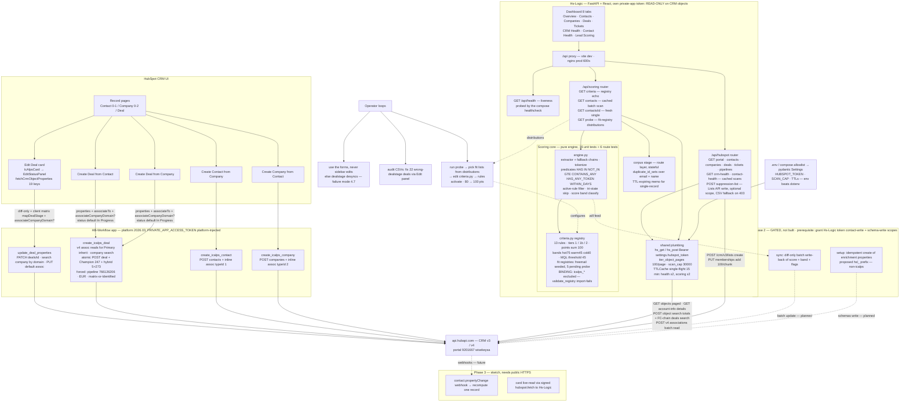
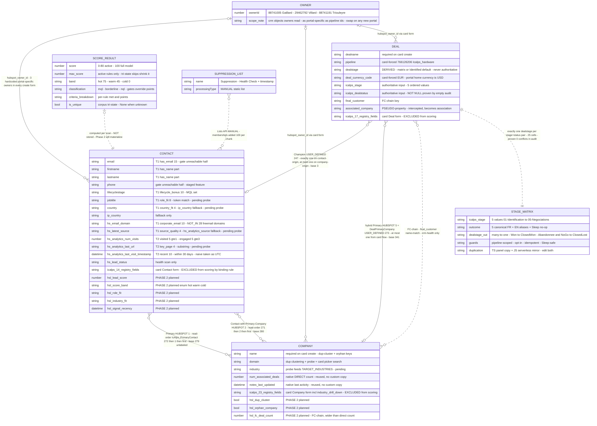

# System Maps — the IcAlps HubSpot platform in three drawings

One unified mental model of everything built across **HB-Workflow** (the CRM
card app) and **Hs-Logic** (the standalone analytics/scoring brain), both
bound to HubSpot portal **9201667** (wisekeysa).

Sources of truth these drawings were distilled from: `HB-Workflow/ui-extension/docs/ARCHITECTURE.md`
(§3.4 association tables, §4 failure modes, §5 cutover), `docs/doubleassociation.md`
(association cardinality semantics), `SALVAGE.md` (frozen execution paths),
the three audit CSVs at the HB-Workflow root (cardinality evidence), and the
live code of both repos (`scoring/criteria.py` is the scoring model's single
source of truth). Where documents disagree with source, source wins — known
drift is listed at the bottom.

- **Map 1 — Mindmap**: the whole mental model on one page (why, what, how, history, roadmap).
- **Map 2 — Logical map**: every endpoint and the logic that governs the flows.
- **Map 3 — Schema map**: entities, their edges (with real association typeIds), and the cardinality constraints the audits evidence.

---

## Map 1 — Unified mental model (mindmap)

```mermaid
mindmap
  root((IcAlps HubSpot Platform<br/>portal 9201667))
    [WHY it exists]
      [No Operations Hub on portal → workflow automation constrained<br/>UI-extension + serverless chosen · native-workflow availability still an OPEN issue]
      [Dual-stage model: icalps_stage + icalps_dealstatus are authoritative, native dealstage is derived]
      [Operators must use the forms — sidebar edits bypass all logic]
      [External brain: analytics + scoring live OUTSIDE the CRM, in Hs-Logic]
      [Two tokens, opposite shapes: card app reads AND writes CRM<br/>Hs-Logic token is read-only — its no-mutation guarantee is scope-enforced]
    [HB-Workflow — card app]
      [Platform 2026.03 · private app · static auth · appId 37414115 prod, 37141512 sandbox]
      [5 CRM cards]
        [Edit Deal — IcAlpsCard → EditStatusPanel<br/>hsmeta MISSING from checkout: drift]
        [Create Deal from Contact + from Company — shared NewIcAlpsDealCard.tsx]
        [Create Contact from Company]
        [Create Company from Contact]
      [4 serverless functions — the only writers]
        [create_icalps_deal — atomic POST with associations]
        [update_deal_properties — PATCH diff, then PUT association]
        [create_icalps_contact — inline assoc typeId 1]
        [create_icalps_company — inline assoc typeId 2]
      [Registry-as-data forms]
        [Deal registry 17 fields + 2 extra fetch keys]
        [Contact registry 14 fields]
        [Company registry 23 fields]
        [FieldRenderer PROP_TYPE switch incl. COMPANY pseudo-property]
      [Proven patterns]
        [Overlay Panel only mounts via trigger overlay prop]
        [Diff-of-changed-fields, one submit, one alert]
        [Forced defaults overlay LAST: pipeline 766126206, EUR, matrix-or-Identified]
        [Percentage divisor ÷100 · serializeForWrite]
        [Panels never call api.hubapi.com — the 401 lesson]
      [Deployment gates]
        [upload → auto-deploy → INSTALL on Distribution tab]
        [new scope = reauthorize · no hot reload exists]
        [POST-400 probe enumerates portal pipeline IDs]
        [prod cutover 2026-04-22]
      [Dealstage matrix]
        [25 cells: 5 stages × 5 canonical outcomes]
        [bilingual canonicalizer FR + EN + Sleep no-op]
        [guards: pipeline scope, opt-in, idempotent]
        [duplicated on purpose: TS panel + JS serverless mirror]
      [Failure modes 4.1–4.7 — each cost build cycles]
    [Association model]
      [deal→contact Champion USER_DEFINED 247 — exactly one on contact-origin, AT MOST one on company-origin: graceful fallback can skip it]
      [deal→company hybrid: HUBSPOT 5 Primary + USER_DEFINED 273 DealPrimaryCompany]
      [read-side detection order 272 → 1 → first-associated]
      [reverse detection 271 → 2 → first-associated]
      [unlabeled bases 3 · 279 · 280 · 341 ride alongside labels]
      [at most ONE Primary per record — label rides beside base, directions independent]
      [no pagination: first page only, >10 companies open question]
    [Data-quality audits — the CSV constraint files]
      [wrong_dealstage_deals.csv — 29 deals stuck at Identified]
        [22 violate mapping · 7 already correct]
        [9 observed stage+status pairs → exactly one expected stage · 0 conflicts]
        [terminal forcing: Won → Closed Won, Abandonnée + NoGo → Closed Lost]
      [status_missing_deals.csv — header-only, meaning AMBIGUOUS]
        [0 rows — yet ARCHITECTURE Build #24 enumerated a status-missing cohort for triage: post-fix export or unfinished audit, unresolved]
      [salvage_issues.csv — 20-issue Phase 7 backlog, 13 open]
        [evidence: only 51 of 759 deals carry the EUR rate stamp]
    [Hs-Logic — the standalone brain]
      [FastAPI + React + docker-compose · own private-app token]
      [14 endpoints: liveness, portal explorer, 2 health scans, suppression list, 4 scoring routes]
      [Token is READ-ONLY on CRM objects · sole write scope crm.lists.write is optional with CSV fallback<br/>Phase 2 write-back additionally requires granting contact-write scopes]
      [Scoring model — criteria.py is the single source of truth]
        [Tier 1 identity: email 15 · corporate domain 10 · name 10 · company 10 · lifecycle 10]
        [Tier 1 pending probe: role fit 8 · country fit 4 · source quality 4]
        [Tier 1b corpus: unique record 5 — tri-state, skipped when unknown]
        [Tier 2 analytics: visited 5 · engaged 5 · recent 10 · key page 4 pending]
        [80 points active → 100 when fit registries configured]
        [gates force NQL: unreachable, anonymous — points cannot override]
        [bands hot 75 · warm 45 · cold 0 · MQL threshold 45]
      [BINDING RULE: icalps_* namespace excluded from scoring — import fails on violation]
      [Corpus stage: duplicate clusters by email + name across full scan]
      [Probe → operator picks fit lists → edits criteria.py → rules self-activate]
      [Plumbing: one paging loop, scan_cap 30000, single-flight TTL caches 15 min]
      [Config as class: Settings, env tuple, compose allowlist, UTF-8-no-BOM gotcha]
      [8 dashboard tabs incl. Lead Scoring]
    [History and governance]
      [Builds 11→24: percentage, body-shadowing, EUR, 401, Champion, hybrid, matrix restore, create parity, status default]
      [Salvation loop: SALVAGE.md re-entry file + issue backlog]
      [Adversarial review gates: 15 + 7 + 8 findings fixed — recorded in git commit messages, not in-repo docs]
      [Test asymmetry: Hs-Logic 22 automated tests · card app has ZERO — its only net is the manual 6-step smoke recipe against live prod]
      [Owner picker: 3 hardcoded portal-specific ownerIds in every create registry]
      [claude-mem + specstory as recovered memory]
    [Roadmap — session-agreed, ahead of in-repo docs]
      [Phase 2 GATED: property manifest setup + diff-only write-back + one-line card display<br/>prerequisite: Hs-Logic token needs contact-write + schema-write scopes]
      [proposed hsl_ prefix — non-icalps by binding rule]
      [Phase 3 sketch: webhooks + signed hubspot.fetch backend — needs public HTTPS]
      [Monorepo merge deferred: bridge-first phasing]
```

---

## Map 2 — Logical map: endpoints and governing logic

---

## Map 3 — Schema map: entities, edges, cardinality constraints

### Cardinality constraints — where each is proven

| Constraint | Evidence |
|---|---|
| Exactly one `expected_dealstage` per `(icalps_stage, icalps_dealstatus)` pair — deterministic, many-to-one | `wrong_dealstage_deals.csv`: 9 observed pairs, 0 conflicts; 25-cell matrix in `dealStageMapping.ts` + JS mirror |
| Every deal has an `icalps_dealstatus` | `status_missing_deals.csv`: header-only, 0 violators (clean-audit certificate); Build #24 panel default guarantees it going forward |
| Terminal status forces closed stage regardless of icalps_stage | audit: 4/4 Won → Closed Won, 4/4 Abandonnée+NoGo → Closed Lost |
| Champion contact per card-created deal: exactly one on contact-origin, **at most one** on company-origin (graceful fallback can attach zero) | `createIcAlpsDeal.js` company-origin branch skip paths; ARCHITECTURE §3.4 graceful fallback; `doubleassociation.md` §4.3 edge-case table |
| At most one company edge from the card flow; at most one Primary label per record; label rides beside the unlabeled base; directions independent | `doubleassociation.md` portal-probe corrections block + §4.3; ARCHITECTURE §3.4 |
| Single-company-per-contact treated as the norm | contact-health flags multi-company contacts as violations |
| One dedup identity per email / per normalized name | health duplicate clusters + scoring `duplicate_id_sets` share the grouping |
| `icalps_*` never a scoring input | `validate_registry()` import-time failure + pinned tests (binding rule) |

### Known drift (document vs source, source wins)

- **Edit-Deal card hsmeta missing**: only 4 `*-hsmeta.json` files exist under `src/app/cards/` while 5 cards are documented and deployed — the Edit card's `card-hsmeta.json` is absent from this checkout.
- Registry field counts per source: Deal 17 (+2 fetch-only), Contact 14, Company 23 — ARCHITECTURE's milestone log says Contact 20 / Company 22 (stale).
- ARCHITECTURE §7 still phrases typeId 279 as "contact→company primary"; the 2026-07-13 portal probe showed 279 is the unlabeled base (1 is Primary).
- ARCHITECTURE §7 still lists the `hubspot_owner_id` picker as deferred; SALVAGE.md records it shipped around Build #14 (3-owner SELECT, confirmed active 2026-06-04).
- `SALVAGE.md` "Build cursor" block (#15) lags its own Threshold block (#19); deployed head is Build #24.
- The `hubspotscripts-master/` directory referenced by SALVAGE.md does not exist in this checkout.
- `status_missing_deals.csv` is header-only, but ARCHITECTURE's Build #24 entry says a status-missing cohort was enumerated for triage — whether the empty file is a post-fix export or an unfinished audit is unresolved.
- The card app has **zero automated tests**; `hs project validate` does not execute functions (§4.2), so its only verification is SALVAGE.md's manual 6-step smoke recipe against live prod. Hs-Logic carries the system's 22 automated tests.
